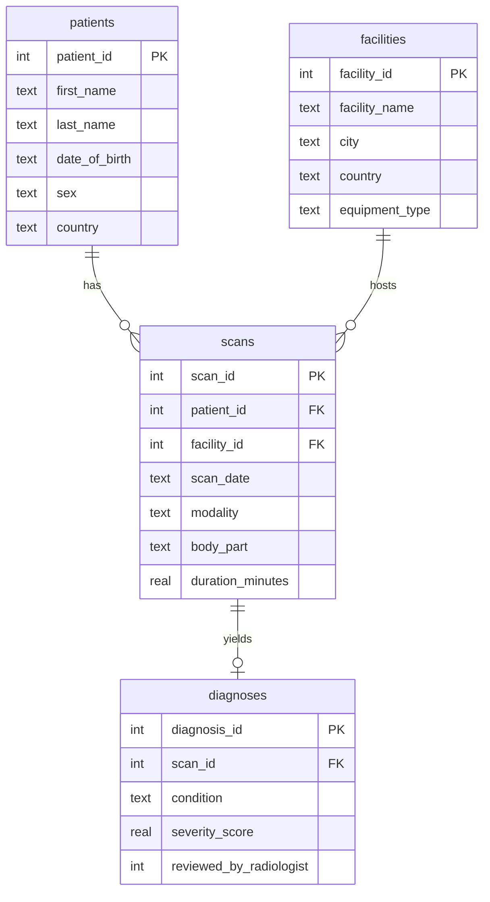

# 🏥 Healthcare Imaging Data Warehouse


I built this project to practice SQL, relational schema design, and Python-based
ETL on a realistic but fully synthetic dataset.  I generated four CSV files
representing a fictional healthcare imaging system (patients, facilities, scans,
diagnoses), made them intentionally messy to simulate real-world data quality
problems, and then wrote an ETL pipeline to clean and load them into a local
SQLite database.  All data is synthetic; no real patient information is
involved anywhere in this project.

I built it as a portfolio piece to demonstrate the kind of work I would do as a
Data Engineer Intern.

---

## 🗺️ Entity-Relationship Overview

I designed the schema with four normalized tables.  The relationships are:

```
facilities                        patients
  facility_id (PK)                  patient_id (PK)
  facility_name                     first_name
  city                              last_name
  country                           date_of_birth
  equipment_type                    sex
       |                            country
       | 1 : many                      |
       |                               | 1 : many
       +-----------> scans <-----------+
                       scan_id (PK)
                       patient_id  (FK -> patients)
                       facility_id (FK -> facilities)
                       scan_date
                       modality
                       body_part
                       duration_minutes
                            |
                            | 1 : 0 or 1
                            v
                       diagnoses
                         diagnosis_id (PK)
                         scan_id (FK -> scans)
                         condition
                         severity_score
                         reviewed_by_radiologist
```

Or as a Mermaid diagram (renders on GitHub):



---

## 🚀 Setup

```bash
pip install -r requirements.txt
python etl.py
python run_queries.py
```

That is the entire setup.  I chose SQLite so there is no database server to
install or configure.  SQLite ships with Python, so the only external
dependency is pandas.

---

## 🛠️ Stack

| Tool | Role |
|------|------|
| Python 3.11+ | ETL scripting and query runner |
| pandas | Data extraction, cleaning, and transformation |
| SQLite | Local relational database, no server required |
| SQL (8 queries) | Joins, aggregations, and window functions |

---

## 📈 What this project demonstrates

| Skill | Where to see it |
|-------|----------------|
| Relational schema design | `schema.sql` - normalized tables, FKs, indexes |
| Python ETL pipeline | `etl.py` - extract, clean, load with logged steps |
| Data quality handling | `etl.py` - 3 date formats, mixed casing, missing values |
| SQL joins and aggregations | `queries.sql` - queries 1, 2, 5, 6, 7 |
| Window functions | `queries.sql` - queries 3 (RANK) and 8 (running COUNT) |
| Healthcare data modeling | schema reflects real imaging operations questions |

---

## 📋 Sample query output

**Query 2: Scan count and average duration per modality**

```
  modality  total_scans  avg_duration_min  min_duration_min  max_duration_min
        CT          189              26.6              15.0              45.0
       MRI          167              27.7              15.0              45.0
Ultrasound           85              26.5              15.0              45.0
     X-Ray           78              24.9              15.0              45.0
```

**Query 7: Average severity score by modality and radiologist review status**

```
  modality  reviewed_by_radiologist  diagnoses_count  avg_severity
        CT                        1               94          5.09
        CT                        0               70          5.00
       MRI                        1               78          4.56
       MRI                        0               62          5.25
Ultrasound                        1               30          5.19
Ultrasound                        0               34          5.23
     X-Ray                        1               40          4.83
     X-Ray                        0               32          5.22
```

---

## 📁 Project structure

```
healthcare-imaging-dw/
├── README.md              this file
├── LICENSE                MIT license
├── CONTRIBUTING.md        how to contribute
├── LEARNINGS.md           what I learned while building this
├── TROUBLESHOOTING.md     issues I hit and how I resolved them
├── requirements.txt       Python dependencies (pandas only)
├── .gitignore
├── data/
│   └── raw/
│       ├── raw_facilities.csv
│       ├── raw_patients.csv
│       ├── raw_scans.csv
│       └── raw_diagnoses.csv
├── schema.sql             CREATE TABLE statements and indexes
├── etl.py                 extract, transform, and load pipeline
├── queries.sql            8 analytical SQL queries
├── run_queries.py         runs queries.sql, prints results
└── warehouse.db           generated SQLite database
```

---

## 📦 ETL pipeline summary

| Step | What I clean |
|------|-------------|
| `normalize_sex` | Mixed casing (m, F, FEMALE) and blanks to F / M / Unknown |
| `parse_dob` | Three date formats in one column to ISO YYYY-MM-DD |
| `normalize_country` | Leading/trailing whitespace and inconsistent casing |
| `normalize_modality` | Variants like `mri`, `ct `, `X-RAY` to canonical set |
| `fill_duration` | Missing values filled with per-modality median |
| `normalize_reviewed` | Yes/TRUE/yes/blank to integer 1 or 0 |
| `drop_duplicates` | Exact duplicate rows removed |
| `check_referential_integrity` | FK validation before load |

---

## 🤝 Contributing

Contributions that improve the queries, data cleaning logic, or schema are
welcome.  See [CONTRIBUTING.md](CONTRIBUTING.md) for details on how to open
an issue or submit a pull request.
